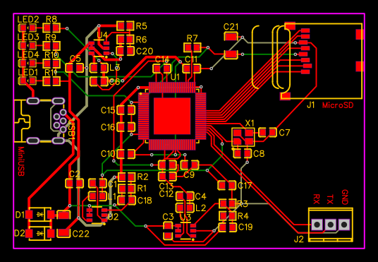

# Experimental Linux Board

- The F10C600 SoC already has RAM and CPU integrated, so I don't have to route the RAM bus
- MicroSD slot to contain Linux firmware
- MiniUSB port for power at the moment (maybe add a UART-to-USB IC later)

